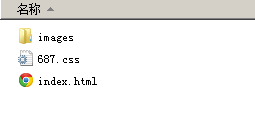

## colorful-elements 

src 开发环境

dist 生产环境

英文彩色生活

`npm install --save-dev gulp gulp-browserify gulp-concat gulp-connect gulp-react lodash reactify gulp-sass gulp-jshint gulp-autoprefixer gulp-livereload  gulp-minify-css gulp-uglify gulp-rename browser-sync gulp-notify gulp-zip

更改目录结构如下
`